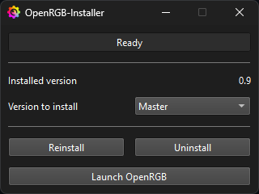

# OpenRGB-Installer

Tiny OpenRGB installer for windows.  
It will download the latest experimental build on each run, and can also serve as an updater.  
It will also create desktop and start menu shortcuts.

## Download and run

- Download latest build [here](https://github.com/Odizinne/OpenRGB-Installer/releases/latest)
- Extract it and run `OpenRGB-Installer.exe`

Installation will automatically be performed to `%localappdata%\programs\OpenRGB Windows 64-bit`

You can then launch OpenRGB or close OpenRGB-Installer.

## Credits

- Edited icon from [thenounproject](https://thenounproject.com/icon/setup-1091975/)